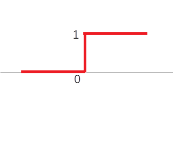

# Redes neurais e Deep Learning utilizando Java
# Neural network and Deep Learning with Java
[**Cleuton Sampaio**](https://github.com/cleuton) - [**LinkedIn**](https://www.linkedin.com/in/cleutonsampaio/) 


Todo o conteúdo, quando não explicitamente indicado, está liberado sob a [licença Creative Commons Atribuição 4.0 Internacional](http://creativecommons.org/licenses/by/4.0/). O código-fonte está liberado sob a [licença Apache 2.0](https://www.apache.org/licenses/LICENSE-2.0).

[**ENGLISH VERSION**](./english): I am translating these articles to english. Be patient!

# Introdução

## Papo furado

Sério, o que sua empresa roda no ambiente de produção? De acordo com a popularidade e as estatísticas, é mais provável que sejam sistemas feitos em **Java**, certo? Claro que sim. Java é o novo **COBOL**. Embora muitos sistemas corporativos e comerciais estejam sendo desenvolvidos em outras linguagens, como **python**, os dados demonstram que Java ainda é a plataforma campeã no mundo corporativo.

E existem razões para isso, por exemplo, o grande número de desenvolvedores Java no mundo. Mas não é só isso... Java é uma plataforma completa, madura e baseada em padrões, com um vasto ecossistema de componentes e frameworks igualmente maduros. Além disso, temos a [performance *acachapante*](https://benchmarksgame-team.pages.debian.net/benchmarksgame/faster/python.html) de Java sobre outras linguagens, como o python. Eu até [**já escrevi um artigo sobre este assunto, no meu outro blog: O Bom programador**](http://www.obomprogramador.com/2019/03/python-paralelismo-e-gil-nem-tudo.html).


Porém, linguagens de script, como python e **R** são muito utilizadas em estudos de ciência de dados, machine learning e **deep learning**, talvez pela facilidade de codificação, ou pelo excelente conjunto de bibliotecas para isto. Realmente, criar um modelo baseado em Redes Neurais em Python ou R, seja utilizando o **Keras** ou outra API, é muito simples. Você só precisa saber COMO criar redes neurais, a implementação é muito enxuta, com baixa [**complexidade acidental**](http://www.obomprogramador.com/2012/12/complexidade-acidental.html). Isso é totalmente o contrário de Java!

Mas dizer que Java não serve para deep learning ou ciência de dados, é simplesmente **papo furado**. 

Eu diria que a melhor linguagem para se trabalhar com qualquer problema de **Inteligência Artificial** (incluíndo ciência de dados) seria **C++**. Por quê? Bom, as bibliotecas foram escritas em C++, e o desempenho é imbatível! Mas C++ é muito difícil de programar e até de compilar! Requer muito tempo e esforço para construir modelos simples. Logo, Java pode ser uma alternativa mais fácil e popular.

Resolvi começar esta série de artigos porque fui convidado a lecionar um curso sobre implementação de soluções de **IA** utilizando Java, e quero compartilhar com vocês a minha experiência. 

Estes primeiros exemplos incluem um [**Perceptron**](./perceptron) e um [**Multi Layer Perceptron**](./multilayerperceptron), ambos feitos em Java, sem o uso de qualquer framework de IA. É **claro que eles não são produtos prontos e nem estão otimizados, tenha isso em mente!** Eu jamais recomendaria que você criasse um framework de redes neurais do zero! Existem vários frameworks que funcionam em Java, como o [**Deeplearning4J**](https://deeplearning4j.org/) ou até mesmo o [**Tensorflow**](https://www.tensorflow.org/install/lang_java) e eu recomendo que você utilize um framework pronto para seus trabalhos de Deep Learning.

O objetivo dos projetos que eu inclui aqui é **apenas ensinar o básico de redes neurais, mostrando sua implementação em Java. Só isso!** Eles não estão otimizados e nem prontos para virarem produtos ou serem utilizados em trabalhos finais.

*Bom proveito!*

## Inteligência artificial

Desde os anos 50, quando um cientista chamado [*John McCarthy* usou este termo pela primeira vez](https://pt.wikipedia.org/wiki/Intelig%C3%AAncia_artificial), a **IA** tem sido alvo de muitos estudos e tendências, especialmente agora, nos últimos 10 anos. 

O estudo de IA tem muitas vertentes, como por exemplo a construção de [**Agentes inteligentes**](https://pt.wikipedia.org/wiki/Agente_inteligente). Uma corrente de estudos focou em criação de [**Sistemas especialistas**](http://www.scielo.br/scielo.php?script=sci_arttext&pid=S0100-19651997000100006), utilizando *motores de inferência*, baseados em regras que utilizam técnicas como **encadeamento para a frente** de modo a concluir sobre dados novos. Eles são capazes de armazenar novas regras e interligá-las de modo a tomar decisões. 

Porém, a especificação de regras requer conhecimento do domínio do problema, portanto, não é tarefa simples. Outra corrente de IA se baseou nos próprios dados, imitando a forma como o nosso cérebro *aprende*, e esta é a corrente que conhecemos como **Redes Neurais**, e seu uso em aprendizagem de máquina é conhecido como *aprendizagem profunda* ou **Deep Learning**.

## Redes neurais

Deep learning (ou aprendizagem profunda) é um ramo da Data Science, mais especificamente de Machine learning, que utiliza grafos de funções em camadas para resolver problemas de classificação e regressão, supervisionados ou não. Estes grafos em camadas são também conhecidos pela metáfora: “Rede neural”,
pois se parecem com a arquitetura do cérebro humano.


Os nós são o que chamamos de **neurônios** e as arestas são os dados e os pesos (veremos mais adiante). Cada neurônio recebe as entradas, multiplica pelos pesos e passa tudo por uma **função de ativação**, que determinará o sinal de saída.


## Deep Learning

Hoje, este termo (*deep learning*) vem ganhando popularidade a cada dia. Em Português significa: "Aprendizagem profunda", que é basicamente utilizar redes neurais para criar modelos de predição (regressão, classificação ou agrupamento). Na Wikipedia temos uma boa definição: 

"
*A aprendizagem profunda, do inglês Deep Learning (também conhecida como aprendizado estruturado profundo, aprendizado hierárquico ou aprendizado de máquina profundo) é um ramo de aprendizado de máquina (Machine Learning) baseado em um conjunto de algoritmos que tentam modelar abstrações de alto nível de dados usando um grafo profundo com várias camadas de processamento, compostas de várias transformações lineares e não lineares.*
"

**Como funciona?**

Quando usamos *deep learning* queremos criar um modelo preditivo, ou seja, um algoritmo capaz de prever algum resultado, com base em variáveis coletadas. Pode ser prever o valor de um imóvel, com base em sua localização e tamanho, ou pode ser classificar uma imagem como sendo um cão, um gato ou uma colher.

Para que o modelo funcione, precisamos *treiná-lo*. Ele precisa "aprender" a associar as variáveis de entrada com uma determinada saída. Uma vez que ele tenha "aprendido" esta associação, podemos usá-lo para fazer **predições** (**inferências**). É claro que, para isto, precisamos salvar o "conhecimento" aprendido para reintroduzi-lo no modelo posteriormente.

Para entender como funciona esse processo de aprendizado, podemos usar um modelo bem simples de rede neural: o **Perceptron** que, na verdade, só tem um nó ou *neurônio*. 

Se o problema for mais complexo, podemos necessitar de um modelo de rede neural mais complexo, como o **Multi Layer Perceptron - MLP** (Perceptron com múltiplas camadas), formado por vários nós organizados em camadas. Na verdade, um MLP é um grafo, onde os nós são transformações e as arestas são valores.

## Perceptron


Na figura, vemos um pereptron típico, com um só nó (*neurônio*). Ele possui nós de entrada, que nada processam. Neste caso, ele recebe duas variáveis, representadas pelos nós **a1** e **a2**, executa uma combinação linear com os pesos (**w1** e **w2**) e usa uma **função de ativação** para calcular qual é a saída **z** gerada. 

Você deve notar que existe uma terceira entrada que apenas tem o valor **1**. É o **bias** (ou **viés**). Ele serve de coeficiente linear da operação, deslocando da raiz. Mesmo que as entradas sejam zeros, a rede será capaz de aprender alguma coisa. O bias é multiplicado pelo seu peso (**bw**) e somado com as entradas x pesos, sendo alimentado no perceptron.

Inicialmente, todos os pesos são gerados aleatóriamente (entre -1 e 1, entre 0 e 1, entre -2 e 2 etc), portando, as primeiras previsões serão incorretas.A saída gerada, **z**, é o nosso valor alvo (ou *target*). Podemos compará-lo com o valor real e quantificar o **erro** que cometemos, portanto, podemos ajustar os pesos para tentar novamente. E fazemos diversas vezes, até que estejamos satisfeitos. 

Para treinar um perceptron, temos algums **parâmetros** a ajustar:
- Quantidade de entradas: (**i**) Quantas variáveis de entrada teremos;
- Quantidade de dados: (**n**) Quantos conjuntos de variáveis teremos para treinar e para testar;
- Taxa de aprendizado: **Learning rate** o quanto vamos ajustar os pesos a cada erro descoberto;
- Número de iterações: (**epochs**) quantas vezes vamos repetir o treinamento com todos os dados de treino;
- Função de ativação: Qual a função de ativação que vamos usar para gerar a saída do nó;
- Função de custo: Qual a função que queremos minimizar com o treinamento.

A **função de ativação** regula a "saída" do neurônio. No caso do perceptron, a função mais utilizada é a **Binary step**: 



```
f(x) = 0 se x < 0 ou 1 caso contrário
```
Mas existem outras, como a **Sigmóide** (*sigmoid*), muito popular: 


No exemplo de perceptron que você verá, eu usei a função de ativação **Binary step**.

**Learning rate** é um parâmetro importante, pois indica o quanto o modelo vai "aprender" a cada erro. Mas, o que é "aprender"? Qual é o objetivo do treinamento? Ai entra a **função de custo**. Em um perceptron, a função de custo pode ser simples como esta: 

```
erro = t - z
```
Ou seja **t** que é o valor real ou **target** menos **z** que é a saída produzida pelo perceptron.

Precisamos otimizar essa função, procurando o seu mínimo e fazemos ajustes nos pesos para cada erro encontrado. Abra o projeto [**perceptron**](./perceptron) e execute. Você verá algo assim: 

```
Iteração: 1, RMSE: 0.2837902619042413
Iteração: 2, RMSE: 0.18318582636182792
Iteração: 3, RMSE: 0.11585688927269845
Iteração: 4, RMSE: 0.0
Iteração: 5, RMSE: 0.0
Iteração: 6, RMSE: 0.0
Iteração: 7, RMSE: 0.0
Iteração: 8, RMSE: 0.0
Iteração: 9, RMSE: 0.0
Iteração: 10, RMSE: 0.0
x1:1.01071991464072 x2: 1.14385421069991 Origem: 1.0 Estimado: 1.0
x1:0.074131851523044 x2: 0.123206823070496 Origem: 0.0 Estimado: 0.0
x1:1.961556880148 x2: 1.46033212028283 Origem: 1.0 Estimado: 1.0
x1:1.71230468169387 x2: 1.96311939860278 Origem: 1.0 Estimado: 1.0
x1:1.70525169301648 x2: 1.30856225370596 Origem: 1.0 Estimado: 1.0
```
Ele **converge** muito rapidamente, chegando a taxas de erro bem pequenas. **Convergir** é o fato do modelo "aprender" a associar entradas com a saída.

**Limitações**

Perceptrons tem a limitação de apenas trabalharem com linearidade, ou seja, no caso de classificação, eles conseguem separar dados que são linearmente separáveis, como os utilizados na demonstração:


Na figura vemos que há duas classes de elementos que podem ser separados apenas por uma reta. 

E se tivermos dados não linearmente separáveis? Um exemplo simples de entender é a função **XOR**:

x | y | XOR
--- | --- | ---
0 | 1 | 1
1 | 0 | 1
0 | 0 | 0 
1 | 1 | 0

Por exemplo, veja o gráfico da função **XOR** note que temos duas classes de elementos: Os que retornam **1** e os que retornam **zero**: 


A única maneira de separá-los seria traçar duas linhas. 

Outro exemplo de associação não linear: 


Um perceptron não vai conseguir convergir com dados como estes. Para isto, precisamos usar mais neurônios, organizados em camadas. Aí entra o **MLP**.

## Multi Layer Perceptron 

Um **MLP** é um modelo de rede com vários nós (*neurônios*), organizados em camadas distintas: 


O processo de aprendizagem de um **MLP** é basicamente o mesmo de um perceptron. Como existem múltiplas camadas de nós e bias, usamos uma técnica para correção de pesos chamada de **back propagation**. 

Outras diferenças são:

- **Função de ativação**: Usamos **sigmoid**, **ReLU**, **TanH** ou outras funções mais avançadas;
- **Função de custo**: Podemos usar **Erro médio quadrático - MSE**, **Raiz do erro médio quadrático - RMSE**, **Soma dos quadrados dos erros - SSE**, **Entropia cruzada - Cross entropy** etc;
- **Método de otimização da função de custo**: Podemos usar **Descida do Gradiente - Gradient Descent** ou **ADAM** para otimizar a função de custo;
- **Frequência de atualização dos pesos**: Se usarmos Gradient Descent, podemos atualizar os pesos só ao final de uma iteração (**Batch Gradient Descent**), ou a cada amostra (**Stochastic Gradient Descent**) ou mesmo a cada intervalo de "n" amostras (**Mini Batch Gradient Descent**).

No exemplo de **MLP** usamos o **GD - Gradient Descent**. O que ele faz? A cada amostra do cojunto, é calculado o erro. Depois, corrigimos cada peso de cada camada, utilizando o gradiente do erro, ou seja, a derivada parcial do erro sobre o peso, usando a **learning rate** para ajustar a velocidade do aprendizado. Poderíamos usar o **SGD - Stochastic Gradient Descent**, selecionando amostras aleatórias dos dados para corrigir os pesos, mas, com amostra tão pequena, não vale a pena.


Nesta otimização, buscamos o **mínimo global** da função de custo e vamos ajustando os pesos até que cheguemos perto dele. Note que, dependendo da função, pode haver **mínimos locais**, o que é indesejável. Para cada erro que encontramos, calculamos as derivadas parciais do erro pelos pesos, para sabermos o quanto cada peso contribuiu para aquele erro. A derivada é a tangente de um ponto da função, portanto, podemos saber o gradiente de cada peso.

Por quê precisamos ajustar a velocidade do aprendizado? Sabe aquele termo em inglês: *jump to conclusion*, pois é... Se a taxa de aprendizado for muito alta, podemos pular o **mínimo global** e jamais convergirmos ou então cairmos em um **mínimo local**. Uma taxa muito baixa vai exigir muitas iterações para convergirmos.

**Forward propagation**

Antes de mais nada, precisamos gerar um conjunto de pesos e fazemos isto de maneira aleatória. Depois, precisamos gerar os valores de entrada, pegando uma amostra e usando suas variáveis. Então, calculamos o valor de cada nó usando o somatório dos valores x pesos e passando pelas funções de ativação, até chegar à saída. 

Este processo pode ser feito com matrizes:


Para cada nó, calculamos o seu novo valor e o submetemos à sua **função de ativação**, gerando seu valor de saída (**outb1**) até chegar ao valor **z**. Eis o trecho de código que faz isso: 

```
	public void forwardPropagation(double [] x) {
		this.input = MatrixUtils.createRealVector(x);
		hiddenValues = hidden.operate(input).add(biasHidden).map(v -> sigmoid(v));
		outputValue  = sigmoid(output.dotProduct(hiddenValues) + biasOutputWeight);
	}
```

Forward propagation é muito simples de implementar com matrizes e vetores, por isso eu usei o pacote [**apache commons math**](https://commons.apache.org/proper/commons-math/).

**Back propagation**

Aqui o **"bicho" pega!** Backpropagation é complexo, pois exige que você conheça bem **álgebra linear** e **cálculo diferencial**, incluindo as **derivadas parciais** e a **regra da cadeia**. Além disso, temos que considerar qual o método de otimização da função de custo e qual a frequência de atualização dos pesos. É um processo doloroso e trabalhoso.

Vou mostrar resumidamente o que seria a atualização de um peso usando [**backpropagation**](https://mattmazur.com/2015/03/17/a-step-by-step-backpropagation-example/), mas nem vou entrar no mérito das [**derivadas parciais**](https://pt.khanacademy.org/math/multivariable-calculus/multivariable-derivatives/partial-derivative-and-gradient-articles/a/introduction-to-partial-derivatives), coisa que foge ao objetivo deste artigo.

Simplifiando ao máximo, começamos o backpropagation atualizando os pesos da camada de saída e depois atualizamos os da camada oculda (hidden).

Vou mostrar como atualizaríamos o peso **w5**, que vai do nó **b1** para o nó de saída:


Cada tipo de peso (regular ou bias) de cada camada tem uma fórmula de atualização diferente. Você pode ver no código de exemplo do [**MLP**](./multilayerperceptron/src/main/java/com/neuraljava/samples/mlp/MLP.java), no método *backPropagation()*. Eu atualizo cada camada e cada tipo de peso separadamente. Poderia fazer isso com matrizes também e, na verdade, foi a minha primeira abordagem, porém, ficaria impossível de entender. 

```
	public void backPropagation(double t) {
		double z = this.outputValue;
		double erro = Math.pow((t-z), 2);
		double deltaz = (z - t) * z * (1 - z);
		this.MSE += erro;
		for(int i=0;i<2;i++) {
			this.output.setEntry(i, 
					this.output.getEntry(i) 
					- this.learningRate 
					* deltaz
					* this.hiddenValues.getEntry(i)				
					);
		}
		this.biasOutputWeight = this.biasOutputWeight 
								- this.learningRate * deltaz;
		for(int i=0;i<2;i++) {
			for(int j=0;j<2;j++) {
				this.hidden.setEntry(i, j, 
						this.hidden.getEntry(i, i) 
						- this.learningRate
						* deltaz
						* this.output.getEntry(j)
						* this.hiddenValues.getEntry(j)
						* (1 - this.hiddenValues.getEntry(j))
						* this.input.getEntry(i)
						);
			}
		}
		for(int i=0;i<2;i++) {
			this.biasHidden.setEntry(i, 
					this.biasHidden.getEntry(i)
					- this.learningRate
					* deltaz
					* this.output.getEntry(i)
					* this.hiddenValues.getEntry(i)
					* (1 - this.hiddenValues.getEntry(i))
					);
		}
		
	}

	private double derivPesosBiasHidden(double t, double z, int i) {
		double deriv = (z-t) * z * (1 - z) 
				* this.output.getEntry(i)
				* this.hiddenValues.getEntry(i)
				* (1 - this.hiddenValues.getEntry(i));
		return deriv;
	}

	private double derivPesosHidden(double t, double z, int i, int j) {
		double deriv = (z-t) * z * (1 - z) * this.output.getEntry(j) 
				* this.hiddenValues.getEntry(j) * (1 - this.hiddenValues.getEntry(j))
				* this.input.getEntry(i);
		return deriv;
	}

	private double derivPesosBiasOutput(double t, double z) {
		return (z-t) * z * (1 - z);
	}

	private double derivPesosOutput(double t, double z, int i) {
		double deriv = (z-t) * z * (1 - z) * this.hiddenValues.getEntry(i);
		return deriv;
	}
```
**Resultado**

Este exemplo, **XOR**, é meio "ingrato". Como são só 4 elementos no arquivo de amostra, temos que rodar muitas iterações ou então mexer nos pesos. O **MLP** converge bem. Comembora talvez você tenha que executar mais de uma vez (eu usei pesos randômicos mais altos). Eis o resultado: 

```
Fim iteração: 493 MSE: 0.036502922841323227
Fim iteração: 494 MSE: 0.036315130105117395
Fim iteração: 495 MSE: 0.03612879832499851
Fim iteração: 496 MSE: 0.035943914147383044
Fim iteração: 497 MSE: 0.035760464333598946
Fim iteração: 498 MSE: 0.0355784357595579
Fim iteração: 499 MSE: 0.03539781541540097
Fim iteração: 500 MSE: 0.035218590405118405
Teste 0 previsto: 1.0 calculado: 0.8164162166620554
Teste 1 previsto: 0.0 calculado: 0.17703646286551075
Teste 2 previsto: 1.0 calculado: 0.8164162166620554
Teste 3 previsto: 0.0 calculado: 0.1952421740319419
```

*Mas nãoe está dando o resultado 0 ou 1!* **CALMA!** É só usar Math.round() para aproximar de zero ou um. Você pode fazer isso na [parte de código que chama a previsão](./multilayerperceptron/src/main/java/com/neuraljava/samples/mlp/TestMLP.java): 

```
		for(int i=0;i<4;i++) {
			mlp.forwardPropagation(teste[i]);
			System.out.println("Teste " + i 
					+ " previsto: " + real[i]
					+ " calculado: " + mlp.outputValue); // use Math.round(mlp.outputValue)
		}
```

## Classificação multiclasse com MLP


Podemos ter vários neurônios (ou nõs) de saída, caso o problema de classificação que queiramos resolver seja multiclasse. Um exemplo disso é o famoso dataset [**IRIS**](http://www.lac.inpe.br/~rafael.santos/Docs/R/CAP394/WholeStory-Iris.html), uma pesquisa classificatória que dividiu as espécies de flores IRIS em 3 categorias, de acordo com 4 características. 

Para classificar as flores, precisamos da **não linearidade** proporcionada por um **MLP**. 

Veja [**esta demonstração em Java puro**](./iris) de uma rede classificadora para o *IRIS Dataset*. Nada de framework, nada de biblioteca... Puro Java.

## Desenvolvimento em Python com produção em Java


Não é preciso muito para concluir que **Java** é uma ótima opção para entregar aplicações em ambiente produtivo. É mais *limpa* e possui menos dependências *espalhadas* que outras linguagens de programação, como **Python** (que, por sinal, eu adoro). 
Mas temos que enxergar a realidade. Enquanto **Python** é excelente para desenvolvimento, prototipação e experimentação, especialmente em ciência de dados e IA, perde um pouco quando pensamos em ambiente produtivo. Por quê? 
- **Performance**: Além da questão do [**GIL**](https://wiki.python.org/moin/GlobalInterpreterLock), há vários *benchmarks* que comprovam o desempenho superior de aplicações Java, como este: https://benchmarksgame-team.pages.debian.net/benchmarksgame/fastest/python.html;
- **Robustez**: Com **Java**, temos pouca **entropia** de ambiente, isso quer dizer, menos dependências *espalhadas* e menos fragilidade. Basta que a JVM esteja instalada corretamente, que o resto das dependências pode ser *embutida* em um **uber jar** ou um **war**. Em outras linguagens, como **Python**, dependemos muito mais de um ambiente configurado, seja com **Anaconda** ou **virtualenv**, o que *espalha* as dependências para fora da sua aplicação;
- **Segurança**: Embora existam decompiladores **Java**, podemos [*obfuscar* o **bytecode**](https://www.owasp.org/index.php/Bytecode_obfuscation) e entregar apenas o *executável*. Em outras linguagens, como **Python**, ficamos limitados a entregar o código-fonte. É claro que podemos utilizar algo como **Cython** e gerar um executável, mas, nem todas as dependências são compatíveis com isto.

O objetivo desta demonstração é mostrar como é possível nos beneficiarmos das vantagens de ambas as ferramentas, **Java** e **Python**, preparando aplicações de **Deep Learning** de maneira fácil e robusta para entrarem em **Produção**.

Esta demonstração consiste em um **notebook** com código **python**, que lê e classifica o dataset **MNIST**, criando um modelo que será lido por um programa **Java**, utilizando-o para classificar novas imagens.

[**Confira tudo aqui**](./python_java_keras)

## GPU ou CPU

GPU é melhor que CPU para processamento de **Deep Learning**? Como programamos uma GPU? Como podemos fazer isso em **Java**? Veja isso tudo em: [**GPU X CPU**](./gpu_cpu).

## CNN usando Java

Veja um modelo completo de reconhecimento facial usando **Convolutional Neural Network** em Java: [**Confira aqui**](./cnn_java).

